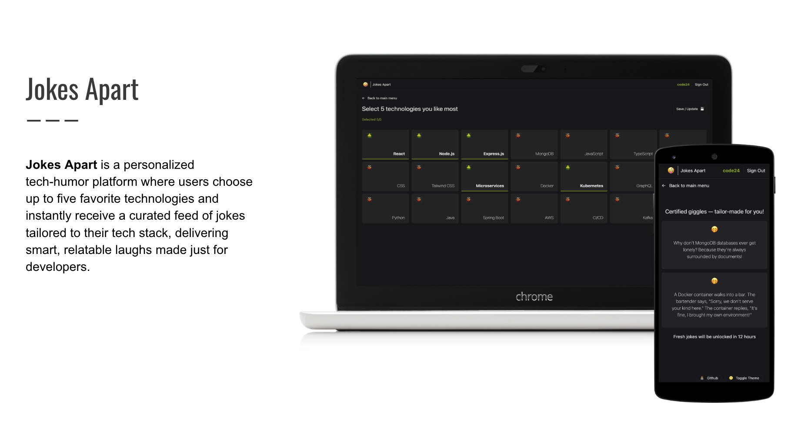

# Jokes Apart



[](https://jokes-apart-app.netlify.app/)
[](https://github.com/YOUR_GITHUB_ORG/jokes-apart/issues)
[](https://github.com/YOUR_GITHUB_ORG/jokes-apart/stargazers)

## What the project does

**Jokes Apart** is a personalized tech-humor web application designed to bring a smile to your face. Users can register, select their favorite technologies (up to five!), and instantly receive a curated feed of hilarious jokes tailored to their chosen tech stacks.

Built with a modern **React JS** frontend, powered by flexible **n8n workflows** for backend logic, and leveraging **Google Sheets** as a lightweight, real-time database, Jokes Apart offers a seamless and interactive experience for tech enthusiasts looking for a good laugh.

## Why the project is useful

In a world full of complex tech, sometimes you just need a good joke! Jokes Apart provides:

*   **Personalized Humor**: Get jokes specifically about the technologies you love (e.g., React, Python, AWS).
*   **Simple & Interactive UX**: An intuitive interface makes registration and joke browsing a breeze.
*   **Real-time Content Delivery**: Jokes are fetched and filtered on-the-fly, ensuring fresh and relevant humor.
*   **Lightweight Architecture**: Demonstrates how powerful applications can be built using a combination of modern frontend frameworks, low-code automation (n8n), and accessible data storage (Google Sheets).
*   **Educational Value**: Serves as a great example for integrating React with n8n and Google Sheets for a full-stack, serverless-like experience.

It's the perfect way to take a break, share a laugh, and stay connected with the lighter side of technology.

## How users can get started

To get Jokes Apart up and running, you'll need to set up both the React frontend and the n8n backend with Google Sheets.

### Prerequisites

*   Node.js (LTS version recommended) & npm/yarn
*   A Google Account (for Google Sheets)
*   An n8n instance (self-hosted or n8n Cloud)

### 1. Backend Setup (n8n & Google Sheets)

#### Google Sheets

1.  **Create your Joke Database**:
    *   Create a new Google Sheet (e.g., named `JokesApartJokes`).
    *   Create at least two columns: `joke` and `tags`.
    *   Populate it with some tech jokes. For example:
        | joke                                                                   | tags           |
        | :--------------------------------------------------------------------- | :------------- |
        | Why do programmers prefer dark mode? Because light attracts bugs!      | programming    |
        | I asked a web developer to tell me a joke. He said, "I'll CSS myself out." | web, css, html |
        | There are 10 types of people in the world: those who understand binary, and those who don't. | binary, programming |
        *The `tags` column should contain comma-separated keywords for each joke.*
2.  **Share the Sheet**: Ensure your Google Sheet is accessible to the n8n instance. If using n8n with a service account, share the sheet with that service account's email. For simpler testing, you can make the sheet publicly viewable (read-only).

#### n8n Workflow

The n8n workflow is responsible for handling incoming HTTP requests, querying the Google Sheet, filtering jokes based on user-selected technologies, and returning a JSON response.

1.  **Obtain the n8n Workflow JSON**:
    *   *You will need the `jokes-apart-workflow.json` file from the repository's `n8n` directory.*
2.  **Import the Workflow**:
    *   Log in to your n8n instance.
    *   Click "Workflows" in the left sidebar, then "New".
    *   Click the "Import from File" button and upload the `jokes-apart-workflow.json` file.
3.  **Configure Credentials**:
    *   Locate the "Google Sheet" node within the workflow.
    *   Click on the node and configure your Google Sheet credentials. This typically involves selecting an existing Google OAuth2 credential or creating a new one. Ensure the credentials have access to your joke Google Sheet.
    *   Update the "Spreadsheet ID" field in the Google Sheet node to match the ID of your created joke sheet.
4.  **Activate the Workflow**:
    *   Click the "Activate" toggle in the top right corner of the n8n workflow editor.
5.  **Get the Webhook URL**:
    *   Once activated, the "Webhook" node will display its URL. Copy this URL, as you'll need it for the frontend configuration. It will look something like `https://your-n8n-instance.com/webhook/YOUR_UNIQUE_ID`.

### 2. Frontend Setup (React JS)

1.  **Clone the Repository**:
    ```bash
    git clone https://github.com/YOUR_GITHUB_ORG/jokes-apart.git
    cd jokes-apart/frontend # Or wherever your React project root is
    ```
2.  **Install Dependencies**:
    ```bash
    npm install
    # or
    yarn install
    ```
3.  **Configure Environment Variables**:
    *   Create a `.env` file in the root of the frontend project (e.g., `jokes-apart/frontend/.env`).
    *   Add your n8n webhook URL:
        ```env
        REACT_APP_N8N_ENDPOINT_URL=YOUR_N8N_WEBHOOK_URL_HERE
        ```
        Replace `YOUR_N8N_WEBHOOK_URL_HERE` with the URL you copied from your n8n workflow.
4.  **Start the Development Server**:
    ```bash
    npm start
    # or
    yarn start
    ```
    The application should now be running in your browser, typically at `http://localhost:3000`.

### Usage

1.  **Register**: Navigate to the application and create a new account.
2.  **Select Technologies**: After logging in, you'll be prompted to select up to five technologies you find interesting.
3.  **Enjoy Jokes**: Instantly receive a personalized feed of tech jokes based on your selections. Refresh the page or navigate back to the home screen to see new jokes!

## Where users can get help

If you encounter any issues or have questions, please refer to the following resources:

*   **GitHub Issues**: The best place to report bugs, suggest features, or ask questions is through the [GitHub Issues page](https://github.com/YOUR_GITHUB_ORG/jokes-apart/issues).
*   **Documentation**: Additional documentation and detailed guides might be found in the `docs/` directory (if available).
*   **n8n Community**: For n8n-specific questions, visit the [n8n community forum](https://community.n8n.io/).

## Who maintains and contributes

This project is maintained by **[Your Name/Team Name]**.

We welcome contributions from the community! If you're interested in improving Jokes Apart, please check out our:

*   **[Contribution Guidelines](CONTRIBUTING.md)**: Details on how to set up your development environment, submit pull requests, and more.
*   **[Code of Conduct](CODE_OF_CONDUCT.md)**: Our standards for a welcoming and inclusive community.

We look forward to your contributions!

---

**Note**: Remember to replace `YOUR_GITHUB_ORG/jokes-apart` with your actual GitHub repository path, and update `[Your Name/Team Name]` in the maintainer section.
